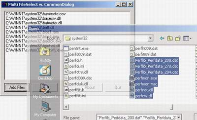



## Select Multiple Files Using CommonDialog

### Description

Simple example of how to select (and retrieve) multiple filenames when using a common-dialog and adding them to a listbox.
 
### More Info
 

             |
---                |---
**Submitted On**   |2001-05-05 17:17:32
**By**             |[rudz](https://github.com/Planet-Source-Code/PSCIndex/blob/master/ByAuthor/rudz.md)
**Level**          |Intermediate
**User Rating**    |4.7 (28 globes from 6 users)
**Compatibility**  |VB 5\.0, VB 6\.0
**Category**       |[Files/ File Controls/ Input/ Output](https://github.com/Planet-Source-Code/PSCIndex/blob/master/ByCategory/files-file-controls-input-output__1-3.md)
**World**          |[Visual Basic](https://github.com/Planet-Source-Code/PSCIndex/blob/master/ByWorld/visual-basic.md)
**Archive File**   |[Select Mul19244552001\.zip](https://github.com/Planet-Source-Code/rudz-select-multiple-files-using-commondialog__1-22968/archive/master.zip)

